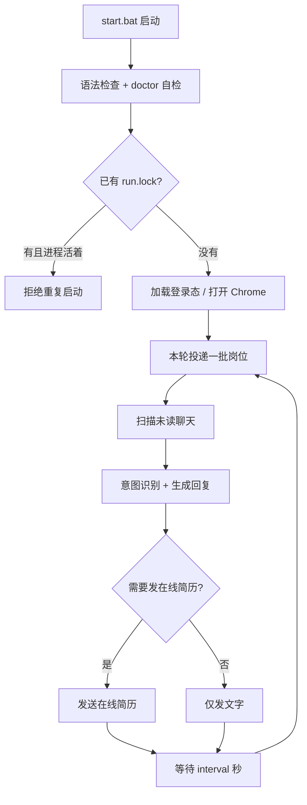

# 业务理解流程（给业务小白）

> 这份文档用「人话」讲清楚：这个项目在 BOSS 直聘上帮你干什么、按什么顺序跑、每一步为什么存在。  
> 读完你应该能回答：**投递是怎么发生的？HR 回消息后系统怎么处理？AI 在哪一步介入？**

相关文档：

- 怎么启动：根目录 [README.md](../README.md)
- 面试资料：本目录 [README.md](./README.md)

---

## 0. 一分钟看懂

把系统想象成一个 **「求职小助手」**，它替你做三件事：

| 步骤 | 人话 | 系统里叫什么 |
|------|------|--------------|
| 1 | 登录 BOSS，保持登录态 | `auth` 登录 / Cookie / Chrome 配置 |
| 2 | 按关键词搜岗位 → 过滤不合适的 → 点「立即沟通」发招呼 | `search` + `apply` |
| 3 | 盯着未读聊天 → 看懂 HR 在问什么 → 自动回 → 必要时发在线简历 | `chat` + `ai` |

日常入口 `start.bat` 做的是一个 **循环**：

```text
投一小批岗位
  → 处理未读 HR 消息（回复 / 发简历）
  → 休息一会儿（默认 180 秒）
  → 再投一批
  → ……一直循环，直到你手动停止
```

---

## 1. 业务目标是什么？

### 1.1 你想解决的痛点

人工在 BOSS 上求职通常是：

1. 搜岗位  
2. 一个个点开看 JD  
3. 合适的点「立即沟通」  
4. 等 HR 回消息  
5. 再一条条回复、发简历、约面试  

这个项目把 **重复劳动** 自动化，并把 **筛选质量**、**回复质量**、**不要骚扰/不要乱投** 做成规则。

### 1.2 项目明确不做的事

- 不训练大模型  
- 不代替你做最终录用决策  
- 默认 **不上传附件 PDF 简历**（只发 BOSS「在线简历」，除非你显式打开开关）  
- 不保证一定通过 HR 筛选（只提升效率与一致性）

### 1.3 当前默认求职方向（可改配置）

在 `config.yaml` 里配置关键词、城市、黑名单等。示例方向常见是测试 / QA / AI 测试相关；你也可以改成自己的方向。

候选人个人信息（姓名、电话、期望薪资等）放在被 git 忽略的 `.env.local.ps1`，避免泄露隐私。

---

## 2. 业务角色与名词表

读代码前先认这些词：

| 名词 | 含义 |
|------|------|
| **BOSS 直聘** | 招聘网站，求职端叫「牛人」，招聘端叫「BOSS/HR」 |
| **立即沟通** | 点一下就向 HR 发起聊天；平台通常会自动带上一条招呼语 |
| **招呼语 / greeting** | 第一次联系 HR 时说的话 |
| **JD** | Job Description，岗位描述 |
| **在线简历** | BOSS 里填好的简历，聊天里点「发简历」发出去 |
| **附件简历** | 本地 PDF；默认关闭，避免误传 |
| **未读** | 聊天列表里有红点/未读标记的会话 |
| **意图（intent）** | 系统对 HR 一句话的分类，如「问薪资」「约面试」「拒绝」 |
| **规则回复** | 不调 AI，用关键词 + 模板直接回 |
| **AI 回复** | 调用大模型（如通义千问）生成更自然的回复 |
| **匹配分** | 投递前对 JD 打分，太低就不投，避免乱投 |
| **运行锁 run.lock** | 防止你同时开两个自动化进程 |

---

## 3. 端到端总流程（必须先看图）



更细一点，可以拆成两条业务线：

### 业务线 A：投递（找工作）

```text
读 config.yaml 关键词
  → 打开搜索页翻页
  → 解析岗位卡片（公司/职位/薪资/链接）
  → 黑名单过滤（公司名、标题关键词）
  → 打开 JD 详情
  → JD 匹配打分（太低 skip）
  → （可选）边界分走 AI 二次判断
  → 点「立即沟通」
  → （可选）AI/模板生成追发招呼语
  → 写日志：成功 / 跳过 / 失败
```

### 业务线 B：聊天（跟 HR 谈）

```text
打开聊天页
  → 找未读会话
  → 点开会话，读最近消息
  → 分类意图（问薪资 / 约面试 / 拒绝 / 噪音…）
  → 高价值意图可走 AI，否则用规则模板
  → reply_guard 清洗（去掉「我是AI」等风险话）
  → 发送文字
  → 若策略要求且尚未发过 → 发在线简历
  → 若是面试邀约 → 记入面试表，可推飞书
  → 更新会话状态（chat_states）
```

---

## 4. 分阶段详解（业务小白版）

### 阶段 0：准备与自检

启动时 `start.bat` 会：

1. **语法检查**：确保核心 Python 文件能编译  
2. **doctor 自检**：Python、依赖、config、Chrome profile、AI 配置是否齐全  
3. **抢运行锁**：写入 `data/run.lock`，避免双开

你需要提前准备：

| 文件 | 作用 |
|------|------|
| `config.yaml` | 搜什么、投多少、黑名单、招呼语模板 |
| `.env.local.ps1` | API Key、候选人画像、开关 |
| 首次登录 | `python -m boss_auto_apply --login` 扫码 |

### 阶段 1：登录与浏览器

**业务含义：** 系统必须像「真人登录过的浏览器」那样访问 BOSS。

实现要点：

- 用 **DrissionPage** 控制 Chrome  
- 独立 **user-data-dir**（`data/chrome_profile_*`）保存登录态  
- 可选 Cookie 文件兜底  
- 检测页面上是否出现登录后才有的元素；若掉到登录页则提示重新 `--login`

**失败时你会看到：**「未登录 / Cookie 失效」——通常重新扫码即可。

### 阶段 2：搜索岗位

**业务含义：** 按你配置的关键词（如「测试开发」「AI测试」）去搜，并翻页收集岗位列表。

过滤逻辑（业务规则）：

- 公司黑名单：名字带某些公司就跳过  
- 标题黑名单：含「实习」「应届」「运维」等就跳过  
- 薪资过低（若配置了下限）可过滤  

产出：一份岗位列表，每条含 `title / company / salary / url` 等。

### 阶段 3：匹配与投递（最核心）

**业务含义：** 不是搜到就投，而是「先判断值不值得投」。

#### 3.1 JD 匹配分（规则引擎）

`jd_matcher` 不调大模型，纯关键词打分：

- **硬过滤**：明显不匹配（如纯前端/算法岗）直接 0 分不投  
- **加分**：技能、业务领域、偏好方向命中  
- **减分**：明显偏离目标  

低于阈值 → **skip**（不点沟通，省额度、少留坏印象）。

#### 3.2 AI 二次审核（可选）

当分数落在「尴尬区间」（不太高也不算废）时，可让 AI 再看一眼 JD：

- 硬过滤的岗位 **永远不放行**  
- AI 说投才投，说不投就 skip  

#### 3.3 点「立即沟通」

BOSS 当前行为大致是：点沟通后平台会发一条默认招呼，并进入聊天页。  
系统可能再追加一句更贴合 JD 的招呼（模板或 AI）。

#### 3.4 每日上限

`config.yaml` 的 `limits.daily_max` 限制一天最多投多少，避免触达平台风控。

### 阶段 4：监听聊天并回复

**业务含义：** 投递后 HR 可能回消息；系统要像靠谱候选人一样回应。

#### 4.1 扫未读

优先处理有未读标记的会话，提高效率。

#### 4.2 意图识别

`reply_engine.MessageClassifier` 用正则按优先级分类，例如：

| 意图 | 业务含义 | 典型处理 |
|------|----------|----------|
| `system_noise` | 系统广播，不是真人 | 不回 |
| `scam_recruit` | 兼职/销售拉人等 | 静默 |
| `od_outsource` | OD/派遣 | 礼貌拒绝 |
| `rejection` | HR 婉拒 | 客气收尾，不再追 |
| `interview_invite` | 约面试 | 记录 + 可飞书提醒 + 礼貌确认 |
| `ask_salary` | 问期望薪资 | 规则或 AI 按画像回答 |
| `ask_resume` | 要简历 | 发在线简历 + 短回复 |
| `ask_tech_detail` / `ask_project` | 问技术/项目 | 优先 AI + RAG |
| `unknown` | 看不懂 | 可走 AI，或保守模板 |

#### 4.3 回复生成优先级

```text
1. 先分类意图
2. 若该意图允许且 BOSS_AI_REPLY=1 → 调 AI（可带 RAG 片段）
3. AI 失败 / 超时 → 回落到规则模板
4. reply_guard 清洗（长度、禁语、风险词）
5. 发送
```

#### 4.4 简历策略（很重要）

默认逻辑：

- 只发 **在线简历**  
- 同一会话若已记录「发过」，不再重复发  
- HR 有新消息且尚未发过简历时，可在回复后追加发简历（由 `auto_resume_on_hr_message` 控制）  
- 附件 PDF 默认关闭（`BOSS_ALLOW_UPLOAD_RESUME=1` 才允许）

### 阶段 5：面试与跟进（辅助）

- 识别到面试邀约 → 写入面试记录 → 可选飞书通知  
- `followup_engine` 可对「HR 久不回」做轻推策略（克制、有次数上限）  
- 看板 / GUI 用来看进度，不替代主流程

### 阶段 6：休息再循环

投完一批 + 聊完一轮后，等待 `interval` 秒（默认 180），再进入下一轮投递。  
目的：模拟真人节奏，降低风控风险。

---

## 5. 配置如何影响业务

### 5.1 `config.yaml`（投递策略）

| 配置块 | 业务影响 |
|--------|----------|
| `search.keywords` | 搜哪些方向 |
| `search.city` | 城市 |
| `greetings` | 招呼语模板池（可随机） |
| `limits.daily_max` | 日投上限 |
| `limits.interval_*` | 操作间隔，防太快 |
| `blacklist` | 明确不投的公司/职位词 |

### 5.2 `.env.local.ps1`（人与 AI）

| 变量 | 业务影响 |
|------|----------|
| `BOSS_CANDIDATE_*` | 回复里用的姓名、经验、期望薪资等 |
| `BOSS_AI_REPLY=1` | 打开 AI 回复 |
| `BOSS_AI_PROVIDER` / `BOSS_QWEN_*` | 用哪家模型 |
| `BOSS_RAG_ENABLE` | AI 是否注入 docs/简历知识片段 |
| `BOSS_ALLOW_UPLOAD_RESUME` | 是否允许上传 PDF |

### 5.3 环境开关（运行时）

`start.bat` 还会设置 Chrome profile 名、调试端口、快速模式等，保证浏览器可复用登录态。

---

## 6. 数据落在哪里？（业务结果怎么查）

都在项目根目录 `data/`（敏感，不要提交 git）：

| 文件/目录 | 业务含义 |
|-----------|----------|
| `chrome_profile_*` | 浏览器登录态 |
| `run.log` | 全程运行日志 |
| `jobs_log.csv` / 投递相关 JSON | 投了谁、成功/失败 |
| `apply_status.json` | 当前卡在哪一步 |
| `chat_states.json` | 每个会话阶段、是否已发简历 |
| `ai_calls.jsonl` | AI 调用记录（不含 API Key） |
| `interviews.json` | 面试邀约 |
| `run.lock` | 是否有任务在跑 |
| `boss_data.db` | 可选 SQLite 同步统计 |

看板：`run_dashboard.bat` → `http://127.0.0.1:8765`

---

## 7. 代码模块 ↔ 业务映射

```text
src/boss_auto_apply/
├── cli/main.py          # 总指挥：登录/投递/聊天/循环
├── browser/auth.py      # 登录与浏览器
├── browser/anti_detect.py # 随机等待、滚动（像真人）
├── apply/search.py      # 搜岗位、过滤
├── apply/jd_matcher.py  # 投前打分
├── apply/apply.py       # 点沟通、发招呼
├── chat/chat_monitor.py # 读聊天列表与消息
├── chat/chat_processor.py # 扫会话 → 回复 → 发简历
├── chat/chat_actions.py # 发消息、发在线简历等 DOM 动作
├── chat/conversation_state.py # 会话状态机
├── ai/reply_engine.py   # 意图分类 + 规则回复
├── ai/ai_reply.py       # 调大模型
├── ai/reply_guard.py    # 发送前安全清洗
├── ai/local_rag.py      # 给 AI 补一点本地知识
├── ai/candidate_profile.py # 候选人画像
├── services/logger.py   # 投递日志与状态
├── services/interview_mgr.py # 面试记录
└── services/notify_feishu.py # 飞书通知（可选）
```

---

## 8. 一条「真实故事」串起来

假设今天你跑 `start.bat`：

1. 自检通过，Chrome 带着上次登录打开。  
2. 用关键词「测试开发」搜到 30 个岗，黑名单滤掉 8 个。  
3. 打开某公司 JD，匹配分 72 → 点立即沟通 → 发一句贴合 JD 的招呼。  
4. 本轮投够 2 个后，进入聊天页。  
5. 发现 HR 问：「方便发份简历吗？期望薪资多少？」  
6. 意图识别为 `ask_resume` + `ask_salary`。  
7. 系统回复期望薪资（来自画像），并发送在线简历；状态标记「已发简历」。  
8. 另一会话是系统「共 128 人投递」广播 → 识别为 `system_noise` → 不回。  
9. 休息 180 秒，再投下一批。

---

## 9. 风险与边界（业务必须知道）

| 风险 | 系统怎么控 | 你还要注意 |
|------|------------|------------|
| 投太猛被限制 | 日上限、随机间隔、循环等待 | 不要手动再开第二个 `start.bat` |
| 乱投不匹配岗 | JD 打分 + 黑名单 | 关键词和黑名单要维护 |
| AI 胡说 / 暴露自动化 | reply_guard、失败回落模板 | 定期看 `ai_calls.jsonl` |
| 重复发简历 | chat_states 记录状态 | 不要清空状态文件乱试 |
| 账号安全 | 本地 profile，不上传云端 | 勿提交 cookies / profile |
| 平台规则变化 | DOM 选择器可能失效 | 页面大改时需要改代码 |

---

## 10. 你怎么验收「业务跑通了」

按这个清单自测：

1. `start.bat --check` 无 FAIL  
2. `--login` 后能打开已登录的 BOSS  
3. `--dry-run` 能打开 JD、打出匹配分，但不真实发送  
4. 小批量真实投 1～2 个，日志里有 success  
5. 手动让 HR 测一条消息（或用已有未读），看是否回复合理  
6. `status.bat` / 看板能看到当前阶段  

---

## 11. 常见业务问题 FAQ

**Q：为什么有的岗位搜到了却不投？**  
A：黑名单、匹配分太低、日上限、页面验证码、或已沟通过。看 `run.log` 里的 skip/failed 原因。

**Q：为什么 AI 开了还是模板回复？**  
A：该意图可能不在 AI 白名单；或 AI 超时/Key 无效；系统会故意回落规则，保证能回。

**Q：为什么不回某些消息？**  
A：可能是系统噪音、诈骗/骚扰、或判定为应静默。这是产品策略，不是 bug。

**Q：投递和聊天可以分开跑吗？**  
A：可以。只投：`--run`；只聊：`--chat-watch`；日常推荐一体循环：`--apply-watch`（即 `start.bat`）。

**Q：业务配置改了要重启吗？**  
A：改 `config.yaml` / `.env.local.ps1` 后需要重新启动进程才会完整生效。

---

## 12. 下一步读什么代码

建议按这个顺序打开（已加业务注释）：

1. `cli/main.py` → `cmd_apply_then_watch`（总循环）  
2. `apply/search.py` → `JobSearcher.search`  
3. `apply/apply.py` → `JobApplier.apply`  
4. `chat/chat_processor.py` → `ChatProcessor` 主处理  
5. `ai/reply_engine.py` → 意图表  
6. `ai/ai_reply.py` → AI 何时启用  

读代码时记住一句话：

> **投递负责「找到人」；聊天负责「谈下去」；AI 只是聊天里的增强插件，不是整条业务的唯一大脑。**
